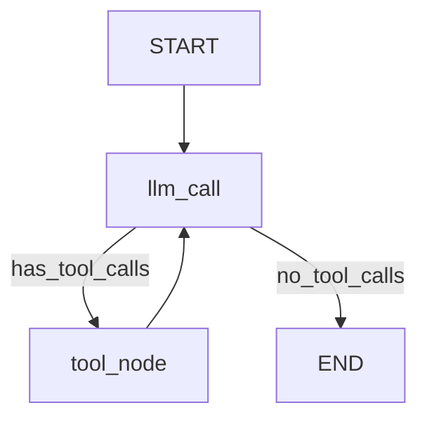

# Calculator Agent - Implementation Summary

This document provides a comprehensive overview of the calculator agent implementation with LangGraph, LiteLLM, and Langfuse.

## Overview

A production-ready calculator agent that demonstrates best practices for:
- **LangGraph**: State-based agent orchestration
- **LiteLLM**: Unified LLM provider interface
- **Langfuse**: Comprehensive observability and tracing

## Architecture

### Pattern: ReAct Agent (Reasoning and Acting)

The agent follows the ReAct pattern from the galen-fastapi-server repository:

```
User Input → LLM Call → Tool Selection → Tool Execution → LLM Call → Final Answer
```

### Key Components

#### 1. **State Management** (`src/agent.py`)
```python
class MessagesState(TypedDict):
    messages: Annotated[list[BaseMessage], operator.add]
    llm_calls: int
```

The state uses `operator.add` annotation to ensure messages are appended, not replaced.

#### 2. **LLM Handler** (`src/llm_handler.py`)
- **Singleton Pattern**: Prevents resource leaks
- **Instance Caching**: Reuses LLM clients based on configuration hash
- **Multi-Provider Support**: Works with OpenAI, Anthropic, and any LiteLLM-compatible provider
- **Connection Pooling**: Optimized HTTP clients with http2 support

#### 3. **Tools** (`src/tools.py`)
- **Type-Safe**: Full Pydantic validation
- **Error Handling**: Graceful handling of edge cases (e.g., division by zero)
- **LangChain Compatible**: Uses `@tool` decorator

#### 4. **Configuration** (`src/config.py`)
- **Pydantic Settings**: Automatic environment variable loading
- **Validation**: Type checking and value validation
- **Nested Structure**: Organized by concern (LLM, Langfuse)

## Implementation Highlights

### 1. Robust Error Handling

Following patterns from galen-fastapi-server, every operation is wrapped with error handling:

```python
try:
    response: AIMessage = self.llm_with_tools.invoke(messages_for_llm)
    
    # Ensure content exists to prevent parsing errors
    if not response.content and not response.tool_calls:
        response.content = "[Thinking...]"
        
    return {"messages": [response], "llm_calls": state.get("llm_calls", 0) + 1}
except Exception as e:
    # Return error message instead of crashing
    error_message = AIMessage(content=f"Error: {str(e)}")
    return {"messages": [error_message], "llm_calls": state.get("llm_calls", 0) + 1}
```

### 2. Langfuse Integration

Automatic tracing of all operations:

```python
config = RunnableConfig(
    recursion_limit=100,
    callbacks=[
        CallbackHandler(
            public_key=self.langfuse_config.public_key,
            secret_key=self.langfuse_config.secret_key,
            host=self.langfuse_config.host,
        )
    ],
)
```

This captures:
- ✅ Every LLM call with input/output
- ✅ Token counts (input, output, total)
- ✅ Tool invocations with arguments
- ✅ Execution time and latency
- ✅ Cost tracking (when configured)

### 3. LLM Instance Caching

The singleton handler prevents resource exhaustion:

```python
def get_llm(self, agent_name: str, llm_config: LLMConfig) -> ChatOpenAI | ChatAnthropic:
    instance_key = self._generate_instance_key(agent_name, llm_config)
    
    if instance_key in self._llm_instances:
        return self._llm_instances[instance_key]  # Reuse existing
    
    # Create new instance
    llm_instance = self._create_openai_instance(llm_config)
    self._llm_instances[instance_key] = llm_instance
    return llm_instance
```

### 4. Graph Structure



**Nodes:**
- `llm_call`: Decides whether to call tools or respond
- `tool_node`: Executes requested tools

**Edges:**
- Conditional edge from `llm_call` based on presence of tool calls
- Loop from `tool_node` back to `llm_call` for multi-step operations

## LiteLLM Integration

### Model Format

Models use the `provider/model-name` format:

```python
# Anthropic Claude
model = "anthropic/claude-sonnet-4-20250514"

# OpenAI GPT-4
model = "openai/gpt-4"

# OpenAI GPT-4o
model = "openai/gpt-4o"
```

### Provider Detection

The handler automatically detects the provider:

```python
@property
def provider(self) -> str:
    model_value = str(self.model)
    return model_value.split("/")[0].lower() if "/" in model_value else "openai"
```

### Base URLs

Different providers require different base URLs:

```python
# Direct OpenAI API
base_url = "https://api.openai.com/v1"

# Direct Anthropic API
base_url = "https://api.anthropic.com/v1"

# LiteLLM Proxy
base_url = "http://localhost:4000"
```

## Error Handling Patterns

### 1. LLM Call Failures

```python
try:
    response = self.llm_with_tools.invoke(messages_for_llm)
except Exception as e:
    print(f"✗ Error during LLM call: {e}")
    error_message = AIMessage(content=f"Error: {str(e)}")
    return {"messages": [error_message], ...}
```

### 2. Tool Execution Failures

```python
@tool
def divide(a: int, b: int) -> float:
    if b == 0:
        raise ValueError("Cannot divide by zero")
    return a / b
```

LangGraph's ToolNode automatically catches tool errors and converts them to ToolMessage objects.

### 3. Configuration Failures

```python
try:
    langfuse = Langfuse(...)
    if langfuse.auth_check():
        return langfuse
except Exception as e:
    print(f"✗ Error initializing Langfuse: {e}")
    return None  # Graceful degradation
```

## Token Counting with Langfuse

Langfuse automatically tracks:

1. **Input Tokens**: Tokens in the prompt
2. **Output Tokens**: Tokens in the response
3. **Total Tokens**: Sum of input and output
4. **Cache Tokens**: Cached prompt tokens (for providers that support it)

View in Langfuse dashboard:
- Traces → Select a trace → View token counts
- Analytics → Token usage over time
- Costs → View estimated costs (requires cost configuration)

## File Structure

```
indication-extraction-agent/
├── src/
│   ├── __init__.py               # Package initialization
│   ├── main.py                   # Entry point with examples
│   ├── agent.py                  # Calculator agent (300+ lines)
│   ├── tools.py                  # Calculator tools
│   ├── llm_handler.py            # LLM management (300+ lines)
│   ├── langfuse_config.py        # Langfuse configuration
│   └── config.py                 # Application settings
├── examples/
│   ├── __init__.py
│   └── custom_usage.py           # Advanced usage examples
├── .env.template                 # Environment variables template
├── .gitignore                    # Git ignore rules
├── pyproject.toml                # Poetry dependencies
├── requirements.txt              # Pip dependencies
├── test_setup.py                 # Setup verification script
├── SETUP.md                      # Detailed setup guide
├── README_CALCULATOR.md          # Main documentation
└── IMPLEMENTATION_SUMMARY.md     # This file
```

## Usage Examples

### Basic Usage

```python
from src.agent import CalculatorAgent

agent = CalculatorAgent(agent_name="MyCalculator")
result = agent.invoke("Add 3 and 4")
print(result["messages"][-1].content)
```

### Streaming

```python
for chunk in agent.stream("Multiply 5 by 6"):
    print(chunk)
```

### Multiple Operations

```python
result = agent.invoke("Multiply 10 by 5, then add 25, then divide by 5")
# Agent automatically chains tool calls
```

## Key Learnings from galen-fastapi-server

### 1. Singleton Pattern for LLM Handlers
**Why**: Prevents file descriptor leaks and resource exhaustion
**How**: `__new__` method ensures only one instance

### 2. Message Content Validation
**Why**: Prevents parsing errors when messages have no content
**How**: Always ensure messages have content, even if placeholder

### 3. Comprehensive Error Wrapping
**Why**: Agent should never crash, always respond gracefully
**How**: Try-catch around all external calls (LLM, tools, config)

### 4. Connection Pool Configuration
**Why**: Better performance and resource utilization
**How**: High-capacity httpx clients with HTTP/2

### 5. Structured Configuration
**Why**: Type safety and validation
**How**: Pydantic Settings with nested structures

## Extending the Agent

### Add New Tools

1. Define tool in `src/tools.py`:
```python
@tool
def subtract(a: int, b: int) -> int:
    """Subtract b from a."""
    return a - b
```

2. Add to tool list:
```python
def get_calculator_tools():
    return [add, multiply, divide, subtract]
```

### Customize System Prompt

Edit `_get_system_prompt()` in `src/agent.py`:

```python
def _get_system_prompt(self) -> str:
    return """Your custom prompt here..."""
```

### Use Different Models

Update `.env`:

```env
LLM_MODEL=openai/gpt-4o
LLM_TEMPERATURE=0.5
LLM_MAX_TOKENS=2000
```

## Testing

### Run Setup Test

```bash
python test_setup.py
```

This verifies:
- ✅ All packages installed
- ✅ Configuration loaded
- ✅ Agent initializes
- ✅ Basic calculation works
- ✅ Tools are available

### Run Examples

```bash
# Basic examples
python -m src.main

# Interactive mode
python -m src.main --interactive

# Advanced examples
python examples/custom_usage.py
```

## Monitoring and Observability

### Langfuse Dashboard

1. **Traces**: View all agent interactions
   - Input messages
   - LLM calls
   - Tool executions
   - Output messages

2. **Analytics**: Analyze usage patterns
   - Token consumption
   - Latency metrics
   - Error rates

3. **Costs**: Track spending (requires cost config)
   - Cost per trace
   - Cost over time
   - Cost by model

### Log Output

The agent provides console feedback:

```
✓ Langfuse initialized successfully for CalculatorAgent
✓ Created and cached new LLM instance for CalculatorAgent
```

## Performance Considerations

### 1. LLM Instance Caching
- First call: Creates and caches instance (~500ms)
- Subsequent calls: Reuses cached instance (~0ms overhead)

### 2. HTTP Connection Pooling
- Max connections: 500
- Keepalive: 30 seconds
- HTTP/2: Enabled for multiplexing

### 3. Token Usage
- System prompt: ~150 tokens
- Tool descriptions: ~100 tokens per tool
- Total overhead: ~400 tokens per call

## Security Best Practices

1. **Never commit `.env`**: Contains API keys
2. **Use environment-specific configs**: Different keys for dev/prod
3. **Rotate API keys regularly**: Both Langfuse and LLM
4. **Monitor usage**: Set up alerts in Langfuse
5. **Validate inputs**: Sanitize user inputs before processing

## Troubleshooting

### Issue: "Error initializing Langfuse"
**Solution**: Check LANGFUSE_PUBLIC_KEY and LANGFUSE_SECRET_KEY in `.env`

### Issue: "Error during LLM call"
**Solution**: Verify LLM_API_KEY and LLM_BASE_URL

### Issue: "ModuleNotFoundError"
**Solution**: Run `pip install -r requirements.txt`

### Issue: Empty responses
**Solution**: Check model permissions and rate limits

### Issue: High token usage
**Solution**: Reduce LLM_MAX_TOKENS or optimize system prompt

## Next Steps

1. ✅ Review SETUP.md for detailed setup instructions
2. ✅ Run test_setup.py to verify installation
3. ✅ Run examples to see the agent in action
4. ✅ Check Langfuse dashboard for traces
5. ✅ Customize the agent for your use case

## Resources

- [LangGraph Documentation](https://langchain-ai.github.io/langgraph/)
- [LangChain Documentation](https://python.langchain.com/)
- [Langfuse Documentation](https://langfuse.com/docs)
- [LiteLLM Documentation](https://docs.litellm.ai/)
- [galen-fastapi-server Repository](https://github.com/your-org/galen-fastapi-server)

## Conclusion

This implementation provides a solid foundation for building production-ready LLM agents with:

- ✅ **Robust error handling** for all failure modes
- ✅ **Comprehensive tracing** with Langfuse
- ✅ **Efficient resource management** via singleton pattern
- ✅ **Multi-provider support** through LiteLLM
- ✅ **Type safety** with Pydantic
- ✅ **Clear separation of concerns** in code organization

The patterns and practices used here are directly derived from the galen-fastapi-server repository and are suitable for production use.

