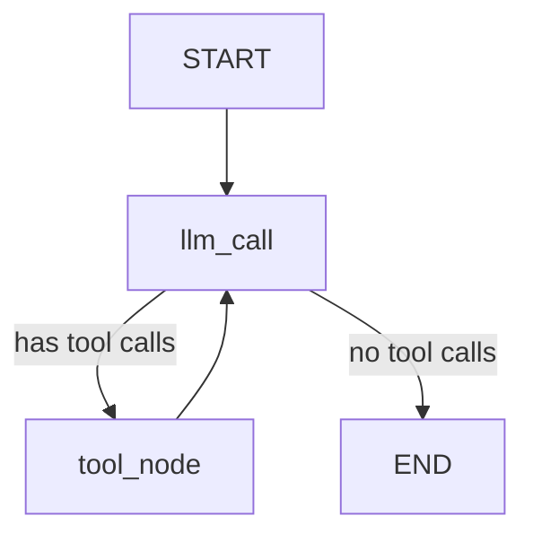

# Calculator Agent with LangGraph, LiteLLM, and Langfuse

A production-ready calculator agent implementation using LangGraph for agent orchestration, LiteLLM for LLM provider abstraction, and Langfuse for comprehensive tracing and observability.

## Features

✨ **LangGraph Integration**: State-based agent workflow with proper graph orchestration
🔧 **LiteLLM Support**: Unified interface for multiple LLM providers (OpenAI, Anthropic, etc.)
📊 **Langfuse Tracing**: Complete observability with token counting and call tracing
🛡️ **Robust Error Handling**: Graceful handling of LLM output parsing and tool calling errors
🎯 **Calculator Tools**: Addition, multiplication, and division operations
🔄 **Stateful Conversations**: Message history management with proper state tracking

## Architecture

This implementation follows patterns from the `galen-fastapi-server` repository:

- **Singleton LLM Handler**: Efficient resource management with instance caching
- **Proper Error Handling**: All LLM calls, tool invocations, and parsing are wrapped with error handlers
- **Configuration Management**: Centralized settings using Pydantic Settings
- **Langfuse Integration**: Automatic tracing of all LLM calls and agent operations

## Project Structure

```
indication-extraction-agent/
├── src/
│   ├── main.py              # Entry point with example usage
│   ├── agent.py             # Calculator agent implementation
│   ├── tools.py             # Calculator tools (add, multiply, divide)
│   ├── llm_handler.py       # Singleton LLM handler with caching
│   ├── langfuse_config.py   # Langfuse configuration
│   └── config.py            # Application configuration
├── .env.template            # Environment variables template
├── .gitignore              # Git ignore rules
├── pyproject.toml          # Project dependencies
└── README_CALCULATOR.md    # This file
```

## Setup

### 1. Install Dependencies

Using Poetry:

```bash
poetry install
```

Or using pip:

```bash
pip install -r requirements.txt
```

### 2. Configure Environment Variables

Copy the environment template and fill in your credentials:

```bash
cp .env.template .env
```

Edit `.env` with your actual values:

```env
# Langfuse Configuration
LANGFUSE_PUBLIC_KEY=pk-lf-your-public-key-here
LANGFUSE_SECRET_KEY=sk-lf-your-secret-key-here
LANGFUSE_HOST=https://cloud.langfuse.com

# LLM Configuration
LLM_API_KEY=your-llm-api-key-here
LLM_BASE_URL=https://api.openai.com/v1
LLM_MODEL=anthropic/claude-sonnet-4-20250514
LLM_TEMPERATURE=0.0
LLM_MAX_TOKENS=4096
```

### 3. Get API Keys

#### Langfuse
1. Sign up at [https://cloud.langfuse.com](https://cloud.langfuse.com)
2. Create a new project
3. Copy your Public Key and Secret Key from the project settings

#### LLM Provider
- **For OpenAI**: Get API key from [https://platform.openai.com/api-keys](https://platform.openai.com/api-keys)
- **For Anthropic**: Get API key from [https://console.anthropic.com/](https://console.anthropic.com/)
- **For LiteLLM Proxy**: Use your proxy URL and credentials

## Usage

### Run Example Calculations

```bash
python -m src.main
```

This will run several example calculations demonstrating the agent's capabilities:

```
Example 1: Simple Addition
User: Add 3 and 4

Example 2: Multiple Operations
User: What is 5 times 6, and then add 10 to the result?

Example 3: Division
User: Divide 100 by 4

Example 4: Complex Calculation
User: Calculate (15 + 25) multiplied by 2, then divide by 10
```

### Interactive Mode

```bash
python -m src.main --interactive
```

This starts an interactive session where you can type calculation requests:

```
🧮 Calculator Agent - Interactive Mode
Type 'exit' or 'quit' to stop

You: What is 25 times 4?
AI: [Response with calculation steps]

You: Now add 50 to that
AI: [Response building on previous context]
```

### Using the Agent in Your Code

```python
from src.agent import CalculatorAgent

# Initialize the agent
agent = CalculatorAgent(agent_name="MyCalculator")

# Invoke with a message
result = agent.invoke("Add 3 and 4")

# Access the messages
for message in result["messages"]:
    print(message.content)

# Check LLM call count
print(f"Total LLM calls: {result['llm_calls']}")

# Stream responses
for chunk in agent.stream("Multiply 5 by 6"):
    print(chunk)
```

## Key Implementation Details

### LLM Handler with Caching

The `LLMHandler` class implements a singleton pattern that caches LLM instances:

```python
from src.llm_handler import llm_handler, LLMConfig

config = LLMConfig(
    api_key="your-key",
    model="anthropic/claude-sonnet-4-20250514",
    temperature=0.0,
    max_tokens=4096
)

llm = llm_handler.get_llm("MyAgent", config)
```

### Error Handling

All LLM calls and tool invocations are wrapped with comprehensive error handling:

- **LLM Call Errors**: Caught and returned as error messages
- **Tool Execution Errors**: Handled gracefully with informative responses
- **Parsing Errors**: Empty content is filled to prevent downstream issues

### Langfuse Tracing

Every agent invocation is automatically traced in Langfuse:

- **LLM Calls**: Model, tokens, latency
- **Tool Calls**: Function name, arguments, results
- **Agent State**: Messages, conversation flow
- **Token Usage**: Input/output token counts

Visit your Langfuse dashboard to see detailed traces.

## Graph Structure

The agent uses the following graph structure:



### Nodes

1. **llm_call**: Invokes the LLM to decide on next action
2. **tool_node**: Executes the requested tools (add, multiply, divide)

### State

```python
class MessagesState(TypedDict):
    messages: Annotated[list[BaseMessage], operator.add]
    llm_calls: int
```

## Extending the Agent

### Adding New Tools

Add new tools to `src/tools.py`:

```python
from langchain_core.tools import tool

@tool
def subtract(a: int, b: int) -> int:
    """Subtract b from a.
    
    Args:
        a: The minuend
        b: The subtrahend
    
    Returns:
        int: The difference
    """
    return a - b
```

Then update `get_calculator_tools()`:

```python
def get_calculator_tools():
    return [add, multiply, divide, subtract]
```

### Customizing the System Prompt

Edit the `_get_system_prompt()` method in `src/agent.py`:

```python
def _get_system_prompt(self) -> str:
    return """Your custom system prompt here..."""
```

### Using Different LLM Providers

Change the model in `.env`:

```env
# For OpenAI GPT-4
LLM_MODEL=openai/gpt-4
LLM_BASE_URL=https://api.openai.com/v1

# For Anthropic Claude
LLM_MODEL=anthropic/claude-sonnet-4-20250514
LLM_BASE_URL=https://api.anthropic.com/v1

# For LiteLLM Proxy
LLM_MODEL=your-model-name
LLM_BASE_URL=http://localhost:4000
```

## Best Practices from galen-fastapi-server

This implementation follows these patterns from the reference repository:

1. **Singleton LLM Handler**: Prevents resource leaks and improves performance
2. **Comprehensive Error Handling**: All operations wrapped in try-catch blocks
3. **Message Content Validation**: Ensures no empty messages to prevent parsing errors
4. **Configuration Management**: Centralized Pydantic Settings
5. **Langfuse Integration**: Consistent tracing with CallbackHandler
6. **HTTP Client Configuration**: Optimized connection pooling with httpx
7. **Type Safety**: Full type hints with Pydantic models

## Troubleshooting

### "Error initializing Langfuse"

- Check your `LANGFUSE_PUBLIC_KEY` and `LANGFUSE_SECRET_KEY` in `.env`
- Verify network connectivity to Langfuse host
- Check if `LANGFUSE_HOST` is correct

### "Error during LLM call"

- Verify your `LLM_API_KEY` is valid
- Check `LLM_BASE_URL` is correct for your provider
- Ensure the `LLM_MODEL` format matches your provider (e.g., `anthropic/model-name`)

### "Division by zero"

- This is expected when dividing by zero
- The agent should handle this gracefully with an error message

## Resources

- [LangGraph Documentation](https://langchain-ai.github.io/langgraph/)
- [LangChain Documentation](https://python.langchain.com/)
- [Langfuse Documentation](https://langfuse.com/docs)
- [LiteLLM Documentation](https://docs.litellm.ai/)

## License

MIT

